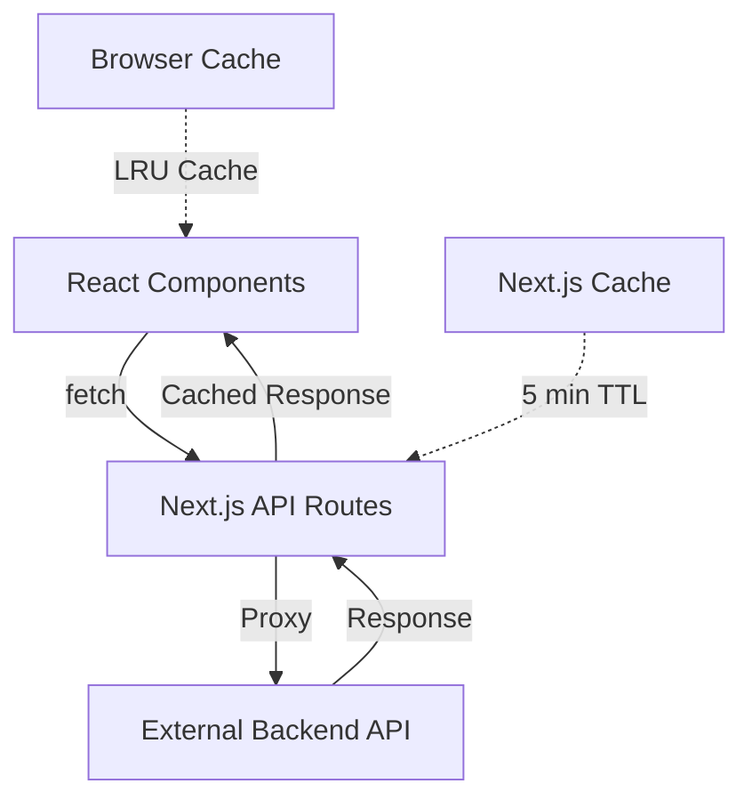

# API Integration Guide

## Overview
This guide details how the PodInsightHQ frontend integrates with APIs, including patterns, examples, and error handling strategies.

## API Architecture



## Data Fetching Patterns

### 1. Direct Fetch (Client-Side)
Used by: TopicVelocityChart, SentimentHeatmap

```typescript
// Pattern: Direct fetch from component with useEffect
import { fetchTopicVelocity } from "@/lib/api";

export function TopicVelocityChart() {
  const [data, setData] = useState(null);
  const [isLoading, setIsLoading] = useState(true);
  
  useEffect(() => {
    const loadData = async () => {
      try {
        setIsLoading(true);
        const response = await fetchTopicVelocity(12); // 12 weeks
        setData(response);
      } catch (error) {
        console.error("Failed to load topic data:", error);
        // Fallback to empty data
        setData({ data: [], signals: [] });
      } finally {
        setIsLoading(false);
      }
    };
    
    loadData();
  }, []);
  
  if (isLoading) return <LoadingSkeleton />;
  return <Chart data={data} />;
}
```

### 2. Proxy Pattern (Search)
Used by: SearchCommandBar

```typescript
// Frontend: Call Next.js API route
async function performSearch(query: string) {
  const response = await fetch('/api/search', {
    method: 'POST',
    headers: { 'Content-Type': 'application/json' },
    body: JSON.stringify({ query, limit: 10 }),
  });
  
  if (!response.ok) {
    throw new Error(`Search failed: ${response.status}`);
  }
  
  return response.json();
}

// Backend: API Route proxies to external API
// app/api/search/route.ts
export async function POST(request: NextRequest) {
  const { query } = await request.json();
  
  // Proxy to external API with server-side token
  const response = await fetch(`${API_URL}/api/search`, {
    method: 'POST',
    headers: {
      'Content-Type': 'application/json',
      'Authorization': `Bearer ${process.env.BACKEND_API_TOKEN}` // SECURITY ISSUE!
    },
    body: JSON.stringify({ query }),
  });
  
  return NextResponse.json(await response.json());
}
```

### 3. Streaming Pattern (Audio)
Used by: Audio clip playback

```typescript
// Frontend: Request audio clip
const audioUrl = `/api/v1/audio_clips/${episodeId}?timestamp=${startTime}`;
audioElement.src = audioUrl;
await audioElement.play();

// Backend: Stream audio response
export async function GET(request: Request, { params }: { params: { episode_id: string } }) {
  const { searchParams } = new URL(request.url);
  const timestamp = searchParams.get('timestamp') || '0';
  
  // Fetch audio from backend
  const audioResponse = await fetch(
    `${API_URL}/audio_clips/${params.episode_id}.mp3?start_time=${timestamp}`
  );
  
  // Stream the response
  return new Response(audioResponse.body, {
    headers: {
      'Content-Type': 'audio/mpeg',
      'Cache-Control': 'public, max-age=3600', // 1 hour cache
    },
  });
}
```

## API Client Configuration

### Central API Client (`/lib/api.ts`)

```typescript
const API_URL = process.env.NEXT_PUBLIC_API_URL || "https://podinsight-api.vercel.app";

// Generic fetch wrapper with error handling
async function apiRequest<T>(
  endpoint: string, 
  options?: RequestInit
): Promise<T> {
  const response = await fetch(`${API_URL}${endpoint}`, {
    ...options,
    headers: {
      'Content-Type': 'application/json',
      ...options?.headers,
    },
    next: { revalidate: 300 }, // 5-minute cache
  });

  if (!response.ok) {
    throw new Error(`API Error: ${response.status} ${response.statusText}`);
  }

  return response.json();
}

// Specific API functions
export async function fetchTopicVelocity(weeks = 12) {
  return apiRequest<TopicVelocityData>(
    `/api/topic-velocity?weeks=${weeks}`
  );
}

export async function fetchSentimentAnalysis(weeks = 12, topics?: string[]) {
  const params = new URLSearchParams();
  params.append('weeks', weeks.toString());
  topics?.forEach(topic => params.append('topics[]', topic));
  
  return apiRequest<SentimentAnalysisResponse>(
    `/api/sentiment_analysis_v2?${params}`
  );
}
```

## Error Handling Strategies

### 1. Graceful Degradation
```typescript
// Return empty data on error
try {
  const data = await fetchSentimentAnalysis();
  return data;
} catch (error) {
  console.error("Sentiment analysis failed:", error);
  return {
    success: false,
    data: [],
    metadata: {
      weeks: 12,
      topics: DEFAULT_TOPICS,
      generated_at: new Date().toISOString()
    }
  };
}
```

### 2. User Feedback
```typescript
// Show error state in UI
const [error, setError] = useState<string | null>(null);

try {
  const results = await performSearch(query);
  setResults(results);
} catch (err) {
  setError("Search is temporarily unavailable. Please try again.");
}

// In JSX
{error && (
  <Alert variant="error">
    <AlertCircle className="h-4 w-4" />
    <span>{error}</span>
  </Alert>
)}
```

### 3. Retry Logic
```typescript
// Exponential backoff retry
async function fetchWithRetry(url: string, options?: RequestInit, retries = 3) {
  for (let i = 0; i < retries; i++) {
    try {
      const response = await fetch(url, options);
      if (response.ok) return response;
      
      // Don't retry client errors
      if (response.status >= 400 && response.status < 500) {
        throw new Error(`Client error: ${response.status}`);
      }
    } catch (error) {
      if (i === retries - 1) throw error;
      
      // Exponential backoff
      await new Promise(resolve => 
        setTimeout(resolve, Math.pow(2, i) * 1000)
      );
    }
  }
}
```

## Caching Strategies

### 1. Next.js Built-in Cache
```typescript
// Server-side caching for 5 minutes
fetch(url, {
  next: { revalidate: 300 }
});

// Force cache refresh
fetch(url, {
  cache: 'no-store'
});
```

### 2. Client-Side LRU Cache
```typescript
// Search cache implementation
class SearchCache {
  private cache = new Map<string, CachedResult>();
  private order: string[] = [];
  private maxSize = 50;

  set(query: string, result: SearchResult) {
    if (this.cache.has(query)) {
      this.order = this.order.filter(q => q !== query);
    }
    
    this.cache.set(query, {
      result,
      timestamp: Date.now()
    });
    this.order.push(query);
    
    // Evict oldest if over limit
    if (this.order.length > this.maxSize) {
      const oldest = this.order.shift()!;
      this.cache.delete(oldest);
    }
  }

  get(query: string): SearchResult | null {
    const cached = this.cache.get(query);
    if (!cached) return null;
    
    // Check if cache is stale (5 minutes)
    if (Date.now() - cached.timestamp > 300000) {
      this.cache.delete(query);
      return null;
    }
    
    return cached.result;
  }
}
```

### 3. Audio Pre-fetching
```typescript
// Pre-fetch audio clips for top search results
useEffect(() => {
  if (!aiAnswer?.sources) return;
  
  // Pre-fetch top 3 audio clips
  aiAnswer.sources.slice(0, 3).forEach(async (source) => {
    if (!audioStates[source.id]) {
      try {
        const url = `/api/v1/audio_clips/${source.episode_id}?timestamp=${source.start_seconds}`;
        const response = await fetch(url);
        if (response.ok) {
          const blob = await response.blob();
          const audioUrl = URL.createObjectURL(blob);
          setAudioStates(prev => ({
            ...prev,
            [source.id]: { url: audioUrl, isLoading: false, error: null }
          }));
        }
      } catch (error) {
        console.error("Pre-fetch failed:", error);
      }
    }
  });
}, [aiAnswer]);
```

## Request Optimization

### 1. Debouncing
```typescript
const searchTimeoutRef = useRef<NodeJS.Timeout>();

const debouncedSearch = useCallback((query: string) => {
  if (searchTimeoutRef.current) {
    clearTimeout(searchTimeoutRef.current);
  }
  
  searchTimeoutRef.current = setTimeout(() => {
    performSearch(query);
  }, 300); // 300ms debounce
}, []);
```

### 2. Request Cancellation
```typescript
const abortControllerRef = useRef<AbortController>();

const performSearch = async (query: string) => {
  // Cancel previous request
  if (abortControllerRef.current) {
    abortControllerRef.current.abort();
  }
  
  const controller = new AbortController();
  abortControllerRef.current = controller;
  
  try {
    const response = await fetch('/api/search', {
      method: 'POST',
      body: JSON.stringify({ query }),
      signal: controller.signal
    });
    
    return response.json();
  } catch (error) {
    if (error.name === 'AbortError') {
      console.log('Request cancelled');
    } else {
      throw error;
    }
  }
};
```

### 3. Batch Requests
```typescript
// Future optimization: Batch multiple topic requests
async function fetchMultipleTopics(topics: string[]) {
  const requests = topics.map(topic => 
    fetch(`/api/topic/${topic}`)
  );
  
  const responses = await Promise.all(requests);
  return Promise.all(responses.map(r => r.json()));
}
```

## Security Considerations

### Current Issues
1. **No Authentication**: API routes are public
2. **Token Exposure**: Server token used in public routes
3. **No Rate Limiting**: Vulnerable to abuse
4. **No CORS Protection**: API accepts any origin

### Recommended Fixes
```typescript
// 1. Add authentication middleware
import { withAuth } from "@/lib/auth";

export const GET = withAuth(async (request, session) => {
  // Only authenticated users can access
  if (!session) {
    return new Response("Unauthorized", { status: 401 });
  }
  // ... rest of handler
});

// 2. Add rate limiting
import { rateLimit } from "@/lib/rate-limit";

const limiter = rateLimit({
  interval: 60 * 1000, // 1 minute
  uniqueTokenPerInterval: 500, // Max users
});

export async function POST(request: Request) {
  try {
    await limiter.check(request, 10); // 10 requests per minute
  } catch {
    return new Response("Too many requests", { status: 429 });
  }
  // ... rest of handler
}

// 3. Add CORS headers
export async function POST(request: Request) {
  const origin = request.headers.get('origin');
  const allowedOrigins = ['https://podinsighthq.com'];
  
  if (origin && !allowedOrigins.includes(origin)) {
    return new Response("CORS error", { status: 403 });
  }
  
  // ... rest of handler
}
```

## TypeScript Types

### API Response Types
```typescript
// Topic Velocity
interface TopicVelocityData {
  data: Array<{
    week: string;
    ai_agents: number;
    capital_efficiency: number;
    depin: number;
    b2b_saas: number;
    crypto_web3: number;
  }>;
  signals: Array<{
    topic: string;
    signal: string;
    confidence: "high" | "medium" | "low";
    date: string;
  }>;
}

// Search Response
interface SearchResponse {
  analysis: {
    answer: string;
    confidence: number;
    key_themes: string[];
    sources_count: number;
  };
  sources: Array<{
    id: string;
    title: string;
    show: string;
    date: string;
    text: string;
    relevance: number;
    timestamp: number;
  }>;
  episodes: Array<{
    id: string;
    title: string;
    show: string;
    date: string;
    relevance: number;
  }>;
}

// Sentiment Analysis
interface SentimentData {
  topic: string;
  week: string;
  sentiment: number; // -1 to 1
  episodeCount: number;
}
```

## Environment Variables
```env
# Required
NEXT_PUBLIC_API_URL=https://podinsight-api.vercel.app

# Security Issue - Should not be in client code!
BACKEND_API_TOKEN=<secret-token>
```