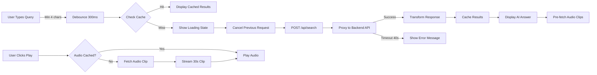
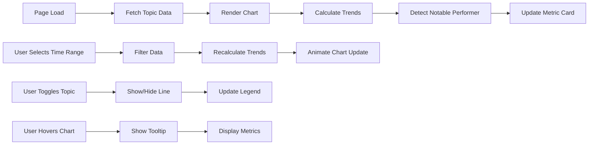
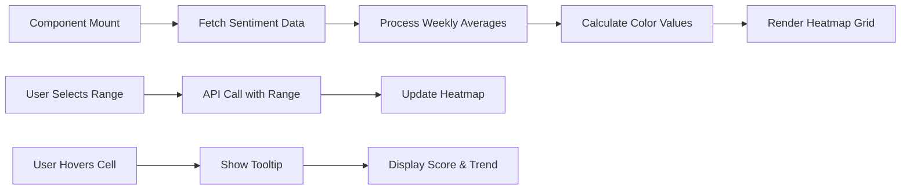
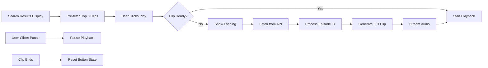
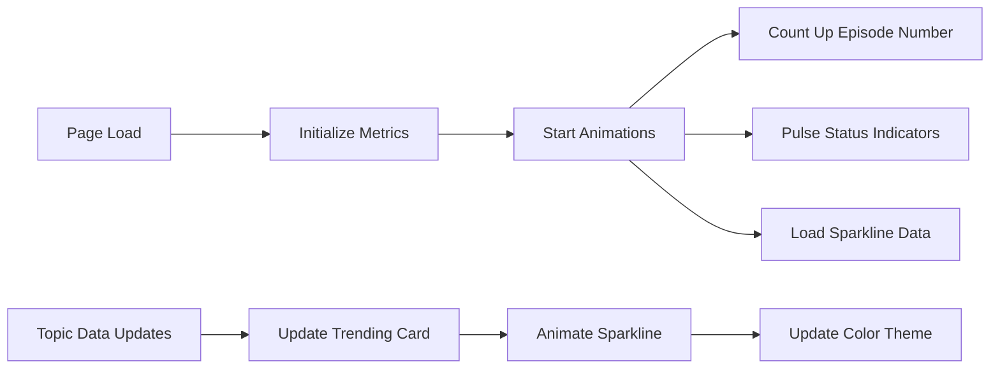

# User Journey Flows

## 1. Search Journey

### Flow Diagram

### Detailed Steps
1. **Query Input**
   - User opens search with ⌘K or clicks search bar
   - Types natural language query (minimum 4 characters)
   - Input is debounced for 300ms to avoid excessive API calls

2. **Cache Check**
   - Client-side LRU cache is checked for existing results
   - Cache key is the exact query string
   - If found, results display instantly

3. **API Request**
   - Previous in-flight requests are cancelled
   - POST request sent to `/api/search` with query
   - Request includes 40-second timeout for cold starts

4. **Cold Start Handling**
   - After 5 seconds, friendly message appears
   - "Still searching... The AI is waking up"
   - Helps set user expectations

5. **Response Processing**
   - AI-synthesized answer with confidence score
   - Source citations with timestamps
   - Results cached client-side

6. **Audio Playback**
   - Play buttons appear next to citations
   - Click triggers audio clip fetch
   - 30-second clips stream immediately
   - Next clips pre-fetched for smooth experience

### Error States
- Query too short: No action
- Network error: "Failed to fetch search results"
- Timeout: "Search took too long. Please try again."
- API failure: "Search is temporarily unavailable"

## 2. Topic Velocity Dashboard Journey

### Flow Diagram

### Detailed Steps
1. **Initial Load**
   - Topic velocity data fetched on component mount
   - Default 3-month view loaded
   - Chart renders with all topics visible

2. **Trend Calculation**
   - Week-over-week changes computed
   - Velocity badges assigned (Accelerating/Steady/Slowing)
   - Notable performer identified (highest % change)

3. **Time Range Selection**
   - User clicks time range button (1W, 1M, 3M, 6M, 1Y, All)
   - Data filtered client-side
   - Chart animates to new view
   - Trends recalculated for selected period

4. **Topic Management**
   - Click topic button to toggle visibility
   - Chart lines fade in/out smoothly
   - Legend updates to show active topics

5. **Interactive Features**
   - Hover shows detailed tooltip
   - Export options: PNG, CSV, PDF
   - Signals appear for significant trends

## 3. Sentiment Analysis Journey

### Flow Diagram

### Detailed Steps
1. **Data Loading**
   - Sentiment data fetched on mount
   - Default 3-month view
   - Loading skeleton displayed

2. **Heatmap Rendering**
   - Weekly sentiment scores by topic
   - Color interpolation: Red (-1) → Yellow (0) → Green (+1)
   - Grid layout with topic rows and week columns

3. **Time Range Filtering**
   - Range buttons: 1M, 3M, 6M, 1Y, All
   - New API call with selected range
   - Smooth transition between views

4. **Cell Interaction**
   - Hover reveals exact sentiment score
   - Episode count for that week/topic
   - Trend direction indicator

## 4. Audio Playback Journey

### Flow Diagram

### Detailed Steps
1. **Pre-fetching Strategy**
   - Top 3 search results have audio pre-fetched
   - Happens silently in background
   - Improves perceived performance

2. **Playback Initiation**
   - User clicks play button on citation
   - If pre-fetched, plays instantly
   - Otherwise shows loading spinner

3. **Clip Generation**
   - Episode ID parsed (supports multiple formats)
   - 30-second clip extracted at timestamp
   - Streamed back as audio/mpeg

4. **Playback Control**
   - Play/pause toggle
   - Only one clip plays at a time
   - Auto-reset when clip completes

## 5. Dashboard Metrics Journey

### Flow Diagram

### Detailed Steps
1. **Initial Animation**
   - Cards fade in with stagger effect
   - Episode count animates from 0 to 1,171
   - Status indicators begin pulsing

2. **Trending Topic Card**
   - Receives notable performer from Topic Velocity
   - Sparkline shows mini trend chart
   - Color matches topic theme

3. **Real-time Feel**
   - "Insights Generated" shows pulse animation
   - "Data Freshness" indicates live status
   - Footer shows seconds since last update

## Common UI Patterns

### Loading States
- Skeleton loaders for data fetching
- Spinner icons for actions
- Progressive disclosure of content

### Error Handling
- Inline error messages
- Fallback UI components
- Retry mechanisms

### Keyboard Navigation
- ⌘K / Ctrl+K: Open search
- /: Quick search
- Escape: Close modals
- Tab: Navigate interactive elements

### Mobile Responsiveness
- Touch-friendly tap targets
- Responsive grid layouts
- Swipe gestures for charts (planned)

## Performance Characteristics

### Time to Interactive (TTI)
1. Initial HTML shell loads
2. JavaScript bundles download and parse
3. React hydrates the page
4. Data fetching begins
5. Full interactivity ~2-3 seconds

### Optimization Opportunities
- Server-side render initial data
- Code split heavy components
- Implement progressive enhancement
- Add service worker for offline