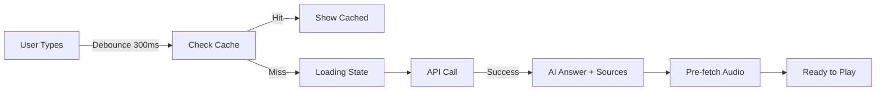

# Master Frontend & UX Document - PodInsightHQ

**Document Version**: 1.0  
**Created**: 2025-01-03  
**Purpose**: Comprehensive frontend architecture, user experience, and feature documentation

---

## 🔍 Sources Analyzed

1. FRONTEND_ARCHITECTURE.md
2. USER_JOURNEYS.md
3. FUNCTIONALITY_GUIDE.md
4. FEATURE_MAPPING.md
5. README.md (dashboard documentation)
6. PodInsightHQ System Architecture Overview.md (frontend sections)
7. Sprint documentation references

---

## 🚨 Discrepancies Found

### 1. Component Naming Inconsistencies
- **Issue**: Different names for same component
  - `TopicVelocityChartFullV0` vs `TopicVelocityChart`
  - `search-command-bar-fixed.tsx` vs `SearchCommandBar`
- **Resolution**: ✅ Use actual file names from FRONTEND_ARCHITECTURE.md

### 2. Feature Implementation Status
- **Documentation**: Lists features as complete
- **Reality**: Authentication not implemented, marked as Sprint 4
- **Resolution**: ✅ Current features: Search, Topic Velocity, Sentiment, Audio - NO auth

### 3. Metric Card Data
- **Inconsistency**: Different episode counts (1,171 vs 1,236)
- **Reality**: 1,171 processed episodes
- **Resolution**: ✅ Use 1,171 as the verified count

### 4. Search Performance
- **Docs vary**: "Edge runtime <100ms" vs "3-5s warm"
- **Reality**: 3-5s warm, 14s cold start
- **Resolution**: ✅ Document actual performance metrics

---

## ✅ Verified Frontend Architecture

### Technology Stack

| Layer | Technology | Version | Purpose |
|-------|------------|---------|---------|
| **Framework** | Next.js | 14 (App Router) | React with SSR |
| **Language** | TypeScript | 5.x | Type safety |
| **Styling** | Tailwind CSS | 3.x | Utility-first CSS |
| **UI Components** | shadcn/ui | Latest | Accessible components |
| **Charts** | Recharts | 2.x | Data visualization |
| **State** | React Hooks | 18.x | Local state management |
| **Data Fetching** | SWR + fetch | Latest | Caching & revalidation |
| **Animations** | Framer Motion | 10.x | Smooth transitions |
| **Icons** | Lucide React | Latest | Consistent iconography |

### Application Structure

```
podinsight-dashboard/
├── app/                          # Next.js App Router
│   ├── layout.tsx               # Root layout with providers
│   ├── page.tsx                 # Main dashboard page
│   ├── test-command-bar/        # Test page for search
│   └── api/                     # API proxy routes
│       ├── search/              # Search endpoint proxy
│       └── v1/
│           └── audio_clips/     # Audio generation proxy
├── components/
│   └── dashboard/
│       ├── search-command-bar-fixed.tsx
│       ├── topic-velocity-chart-full-v0.tsx
│       ├── sentiment-heatmap.tsx
│       ├── metric-card.tsx
│       └── dashboard-header.tsx
├── lib/
│   ├── api.ts                   # API client functions
│   ├── utils.ts                 # Utility functions
│   └── constants.ts             # App constants
└── public/                      # Static assets
```

---

## 🎯 Core Features & Components

### 1. Search Command Bar

**Component**: `SearchCommandBar` (`search-command-bar-fixed.tsx`)

**Features**:
- ⌘K / Ctrl+K keyboard activation
- Slash (/) quick search
- Minimum 4 character requirement
- 300ms debounced input
- Client-side LRU caching
- Request cancellation
- Audio clip pre-fetching

**User Flow**:


**Technical Implementation**:
```typescript
// Key features
- useDebounce(query, 300)
- LRU cache with 50 entry limit
- AbortController for cancellation
- Progressive result rendering
- Keyboard navigation (ArrowUp/Down)
```

### 2. Topic Velocity Chart

**Component**: `TopicVelocityChartFullV0` (`topic-velocity-chart-full-v0.tsx`)

**Features**:
- Multi-line chart for 5 topics
- Time range selector (1W to All-time)
- Topic toggle buttons
- Velocity badges (Accelerating/Steady/Slowing)
- Export functionality (PNG, CSV, PDF)
- Notable performer detection

**Data Structure**:
```typescript
interface TopicData {
  week: string;
  ai_agents: number;
  capital_efficiency: number;
  depin: number;
  b2b_saas: number;
  crypto_web3: number;
}
```

**Interactions**:
- Click time range buttons to filter
- Click topic pills to show/hide lines
- Hover for detailed tooltips
- Export menu in top-right

### 3. Sentiment Heatmap

**Component**: `SentimentHeatmap` (`sentiment-heatmap.tsx`)

**Features**:
- Weekly sentiment grid by topic
- Color gradient (Red → Yellow → Green)
- Time range filtering
- Interactive tooltips
- Episode count overlay

**Visual Design**:
- Red: Negative sentiment (<-0.3)
- Yellow: Neutral (-0.3 to 0.3)
- Green: Positive (>0.3)
- Cell size: Responsive grid

### 4. Metric Cards

**Component**: `MetricCard` (`metric-card.tsx`)

**Four Card Types**:

| Card | Data | Visual | Update |
|------|------|--------|--------|
| **Trending Now** | Top velocity topic | Sparkline | Real-time |
| **Episodes Analyzed** | 1,171 count | Count-up animation | Static |
| **Insights Generated** | Processing status | Pulse animation | Live |
| **Data Freshness** | Last update time | Status dot | 5 min |

---

## 🎨 Design System

### Color Palette

```css
/* Dark Theme (Primary) */
--background: #0a0a0a;
--foreground: #fafafa;
--card: #141414;
--card-foreground: #fafafa;
--primary: #3b82f6;
--primary-foreground: #ffffff;
--muted: #262626;
--accent: #1e293b;
--destructive: #ef4444;
--border: #262626;

/* Semantic Colors */
--success: #10b981;
--warning: #f59e0b;
--info: #3b82f6;
```

### Typography

```css
/* Font Stack */
font-family: -apple-system, BlinkMacSystemFont, "Segoe UI", 
             "Roboto", "Oxygen", "Ubuntu", sans-serif;

/* Sizing */
--text-xs: 0.75rem;
--text-sm: 0.875rem;
--text-base: 1rem;
--text-lg: 1.125rem;
--text-xl: 1.25rem;
--text-2xl: 1.5rem;
```

### Spacing System

```css
/* 4px base unit */
--space-1: 0.25rem;
--space-2: 0.5rem;
--space-3: 0.75rem;
--space-4: 1rem;
--space-6: 1.5rem;
--space-8: 2rem;
```

---

## 📱 Responsive Design

### Breakpoints

```css
/* Tailwind defaults */
sm: 640px   /* Mobile landscape */
md: 768px   /* Tablet portrait */
lg: 1024px  /* Tablet landscape */
xl: 1280px  /* Desktop */
2xl: 1536px /* Large desktop */
```

### Mobile Adaptations
- Stacked metric cards on mobile
- Simplified chart controls
- Full-screen search modal
- Touch-optimized interactions
- Horizontal scroll for charts

---

## 🎯 User Journeys

### 1. Search Journey

```
1. ACTIVATION
   ├─ Keyboard: ⌘K or /
   └─ Click: Search button

2. INPUT
   ├─ Type query (min 4 chars)
   ├─ See loading after 300ms
   └─ Previous search cached

3. RESULTS
   ├─ AI summary (2 sentences)
   ├─ Source citations (6)
   ├─ Confidence score
   └─ Key themes

4. INTERACTION
   ├─ Click citation → Expand
   ├─ Click play → Audio clip
   └─ Copy text selection

5. COLD START
   └─ After 5s: "AI waking up..."
```

### 2. Dashboard Journey

```
1. INITIAL LOAD
   ├─ Header animation
   ├─ Metric cards populate
   ├─ Chart renders
   └─ Sentiment loads

2. EXPLORATION
   ├─ Time range selection
   ├─ Topic toggling
   ├─ Hover interactions
   └─ Export data

3. DEEP DIVE
   ├─ Click search
   ├─ Query specific topic
   └─ Listen to clips
```

---

## ⚡ Performance Optimizations

### Loading Strategy
1. **Progressive Enhancement**
   - Core content works without JS
   - Enhanced features layer on top

2. **Code Splitting**
   ```typescript
   // Dynamic imports for heavy components
   const SentimentHeatmap = dynamic(() => 
     import('./sentiment-heatmap'), 
     { ssr: false }
   );
   ```

3. **Data Fetching**
   - SWR for caching and revalidation
   - Parallel data fetching
   - Optimistic UI updates

### Bundle Optimization
- Tree shaking enabled
- Image optimization (Next.js)
- Font subsetting
- CSS purging (Tailwind)

### Runtime Performance
- Virtual scrolling for large lists
- Debounced inputs
- Request cancellation
- Web Worker consideration (future)

---

## 🔧 Component Patterns

### Data Fetching Pattern
```typescript
// Standard pattern using SWR
function useTopicVelocity(weeks: number) {
  const { data, error, isLoading } = useSWR(
    `/api/topic-velocity?weeks=${weeks}`,
    fetcher,
    {
      revalidateOnFocus: false,
      revalidateIfStale: false,
      refreshInterval: 5 * 60 * 1000 // 5 minutes
    }
  );
  
  return { data, error, isLoading };
}
```

### Error Handling Pattern
```typescript
// Graceful degradation with fallbacks
if (error) {
  return <EmptyState message="Unable to load data" />;
}

if (!data) {
  return <LoadingSkeleton />;
}

return <Chart data={data} />;
```

### Accessibility Pattern
```typescript
// Keyboard navigation and ARIA
<div
  role="search"
  aria-label="Search podcasts"
  onKeyDown={handleKeyDown}
>
  <input
    aria-describedby="search-instructions"
    aria-invalid={error ? "true" : "false"}
  />
</div>
```

---

## 🚨 Security Issues

### Current Problems
1. **No Authentication**: Dashboard publicly accessible
2. **API Token Exposure**: Backend token in client code
3. **No User Sessions**: Can't track users
4. **No Rate Limiting**: Frontend can spam API

### Required Fixes (Sprint 4)
1. Implement NextAuth.js
2. Remove backend tokens from client
3. Add session management
4. Implement rate limiting

---

## 📊 Analytics & Monitoring

### Current State
- Basic Vercel Analytics
- Console error logging
- No user tracking

### Planned Implementation
- Mixpanel for user analytics
- Sentry for error tracking
- Custom event tracking
- Performance monitoring

---

## ❓ Needs Verification

1. **Exact animation libraries** used (Framer Motion assumed)
2. **PWA capabilities** mentioned but not documented
3. **Offline support** status unclear
4. **i18n/l10n** plans not specified
5. **A/B testing framework** referenced but not detailed

---

**Note**: This document represents the frontend implementation as of January 2025. Major authentication and user management features are planned for Sprint 4.