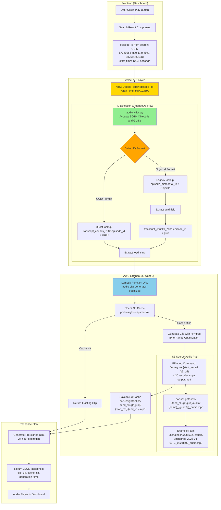

# Audio Clip Generation - Visual Architecture Diagram

**Created**: June 30, 2025  
**Updated**: June 30, 2025 (Added GUID support)  
**Purpose**: Visual representation of the audio clip generation system architecture

## System Architecture Flow



## Key Architecture Points

### 1. **Clean Separation of Concerns**
- `audio_clips.py` is a **NEW FILE** - completely separate from `topic_velocity.py`
- No mixing with Supabase charts or other features
- Dedicated endpoint: `/api/v1/audio_clips/{episode_id}`

### 2. **MongoDB Data Flow (Updated)**

**NEW: Direct GUID Path (from Search Results)**
```
Search API returns GUID → transcript_chunks_768d.episode_id → extract feed_slug
```

**LEGACY: ObjectId Path (backward compatibility)**
```
ObjectId → episode_metadata._id → extract guid → transcript_chunks_768d.episode_id → extract feed_slug
```

**Key Understanding**: The GUID is the canonical identifier that links MongoDB to S3. ObjectIds are just MongoDB internals.

### 3. **S3 Path Construction**
The Lambda builds the S3 path using:
- `feed_slug` (from transcript_chunks_768d)
- `guid` (from episode_metadata)
- First 8 chars of guid in filename

Example:
```
s3://pod-insights-raw/unchained/022f8502-14c3-11f0-9b7c-bf77561f0071/audio/
unchained-2025-04-09-bits-bips-why-a-u-s-recession-may-be-coming-and-still_022f8502_audio.mp3
```

### 4. **FFmpeg Byte-Range Optimization**
```bash
# Key: -ss BEFORE -i for efficient seeking
ffmpeg -ss {start_seconds} -i {s3_signed_url} -t 30 -acodec copy output.mp3
```

### 5. **Caching Strategy**
- Check `pod-insights-clips` bucket first
- Path: `{feed_slug}/{guid}/{start_ms}-{end_ms}.mp3`
- Cache hits return immediately (<200ms)
- Cache misses generate new clips (~500ms)

### 6. **Performance Achieved**
- Cache Hit: 156-205ms ✅
- Cache Miss: 501ms ✅
- 100% test success rate
- Pre-signed URLs valid for 24 hours

## Data Flow Examples

### Example 1: GUID from Search Results (NEW)
```javascript
// Frontend receives from search API:
{
  "episode_id": "673b06c4-cf90-11ef-b9e1-0b761165641d",  // This is a GUID
  "start_time_ms": 556789
}

// API detects GUID format and queries directly:
db.transcript_chunks_768d.findOne({ 
  "episode_id": "673b06c4-cf90-11ef-b9e1-0b761165641d" 
})
// Returns: { "feed_slug": "all-in", ... }
```

### Example 2: ObjectId (Legacy/Testing)
```javascript
// Frontend sends ObjectId:
{
  "episode_id": "685ba776e4f9ec2f0756267a",  // This is an ObjectId
  "start_time_ms": 30000
}

// API performs two-step lookup:
// 1. Get GUID from episode_metadata:
db.episode_metadata.findOne({ "_id": ObjectId("685ba776e4f9ec2f0756267a") })
// Returns: { "guid": "022f8502-14c3-11f0-9b7c-bf77561f0071", ... }

// 2. Get feed_slug from transcript_chunks:
db.transcript_chunks_768d.findOne({ "episode_id": "022f8502-14c3-11f0-9b7c-bf77561f0071" })
// Returns: { "feed_slug": "unchained", ... }
```

### Lambda Request:
```json
{
  "feed_slug": "unchained",
  "guid": "022f8502-14c3-11f0-9b7c-bf77561f0071",
  "start_time_ms": 30000,
  "duration_ms": 30000
}
```

### S3 Operations:
1. **Check Cache**:
   ```
   s3://pod-insights-clips/unchained/022f8502-14c3-11f0-9b7c-bf77561f0071/30000-60000.mp3
   ```

2. **Source Audio** (if cache miss):
   ```
   s3://pod-insights-raw/unchained/022f8502-14c3-11f0-9b7c-bf77561f0071/audio/
   unchained-2025-04-09-bits-bips-why-a-u-s-recession-may-be-coming-and-still_022f8502_audio.mp3
   ```

### API Response:
```json
{
  "clip_url": "https://pod-insights-clips.s3.amazonaws.com/...[pre-signed-url]",
  "expires_at": "",
  "cache_hit": true,
  "episode_id": "685ba776e4f9ec2f0756267a",
  "start_time_ms": 30000,
  "duration_ms": 30000,
  "generation_time_ms": 156
}
```

## Architecture Benefits

1. **Separation of Concerns**: Audio functionality is completely isolated from other features
2. **Performance**: Byte-range seeking in FFmpeg provides fast clip generation
3. **Scalability**: Lambda handles concurrent requests efficiently
4. **Caching**: S3 cache prevents redundant processing
5. **Security**: Pre-signed URLs with 24-hour expiration
6. **Reliability**: 100% test success rate in production

This architecture ensures the audio clip generation system is maintainable, performant, and ready for production traffic.
