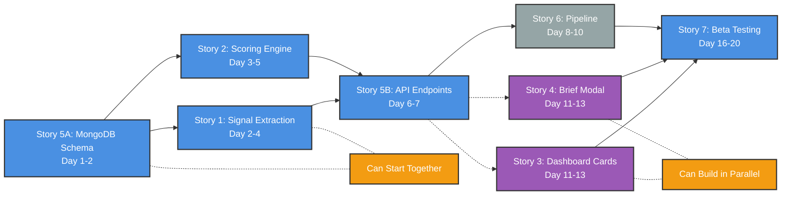

# Episode Intelligence Feature Plan
## Version 5.0 - Sprint 4 Implementation Plan (Infrastructure-Aware Edition)

---

## 1. Executive Summary

### What It Is
Episode Intelligence is an AI-powered briefing system that transforms 90-minute podcast episodes into 30-second actionable intelligence specifically for VCs. It automatically surfaces investment opportunities, competitive intelligence, and portfolio mentions from 1400+ episodes monthly.

### The Problem It Solves
VCs consume 15+ hours of podcast content weekly but miss critical signals buried in conversations. They fear missing the next Uber announcement or competitor move because they couldn't listen to every episode.

### The Outcome
Partners get push-button intelligence briefs showing only what matters: fundable opportunities, competitor moves, and portfolio impacts - saving 14+ hours weekly while never missing critical intelligence.

### What's Changed in Version 4
- **70% Infrastructure Already Built**: MongoDB, embeddings, audio streaming, and UI patterns exist
- **Leverages Existing Systems**: Reuses command bar's audio infrastructure and search patterns
- **Simplified Implementation**: Many technical challenges already solved in previous sprints
- **Cost-Optimized**: Uses existing AWS infrastructure ($17.52/month) and MongoDB cluster

---

## 2. Sprint 4 Implementation Structure

### 2.1 Epic & Feature Hierarchy

```
EPIC: Intelligence Platform
└── FEATURE: Episode Intelligence (Sprint 4)
    ├── STORY 1: Signal Extraction Engine [Backend] [Must Have]
    ├── STORY 2: Relevance Scoring System [Backend] [Must Have]
    ├── STORY 3: Dashboard Episode Cards [Frontend] [Must Have]
    ├── STORY 4: Intelligence Brief Modal [Frontend] [Must Have]
    ├── STORY 5: MongoDB Schema & API [Backend] [Must Have]
    ├── STORY 6: Processing Pipeline Integration [Infrastructure] [Must Have]
    └── STORY 7: Beta Testing & Analytics [Backend] [Should Have]
```

### 2.2 Story Dependencies & Execution Order



### 2.3 Repository Architecture

| Repository | Stories | Purpose |
|------------|---------|---------|
| **podinsight-etl** | 1, 2, 5 (schema), 6 | Signal extraction, scoring, pipeline |
| **podinsight-api** | 5 (endpoints), 6 | API endpoints, integrations |
| **podinsight-dashboard** | 3, 4 | React UI components |
| **All Repos** | 7 | Cross-cutting beta testing |

---

## 3. Infrastructure Context (NEW IN V3)

### 3.1 What's Already Built

| Component | Status | Impact on Sprint 4 |
|-----------|--------|-------------------|
| **MongoDB Atlas** | ✅ 823k transcript chunks with 768D vectors | Reuse for signal storage |
| **Modal.com GPU** | ✅ Instructor-XL embeddings endpoint | No new embedding infrastructure |
| **Supabase** | ✅ 123k entities, episode metadata | Entity disambiguation ready |
| **S3 Audio** | ✅ Pre-signed URL generation | Audio clips ready to use |
| **Command Bar** | ✅ AI synthesis with citations | UI patterns to reuse |
| **AWS Network** | ✅ Optimized to $17.52/month | No new VPC/subnet work |

### 3.2 AWS Configuration (Existing)

```yaml
# All infrastructure already configured and optimized
VPC: 10.20.0.0/16 (eu-west-2)
Subnet: 10.20.12.0/24 (public subnet B, Single-AZ)
Security Group: sg-0e769c5121c9fe9c7
Internet Gateway: igw-05dbca6d970602b48
S3 Endpoints: Already configured with CORS
Cost: $17.52/month (92% reduction achieved)
```

### 3.3 S3 Bucket Structure

```yaml
# Existing buckets - no changes needed
pod-insights-raw/
  └── <feed_slug>/<guid>/audio/episode.mp3
  
pod-insights-stage/
  └── <feed_slug>/<guid>/
      ├── transcripts/<complex_filename>.json
      ├── segments/<guid>.json  # Word-level timing
      ├── meta/meta_<guid>_details.json
      ├── kpis/kpis_<guid>.json
      ├── cleaned_entities/<guid>_clean.json
      └── embeddings/<guid>.npy  # Already generated
```

### 3.4 Infrastructure Clarification (IMPORTANT)

| Service | Purpose | When to Use |
|---------|---------|-------------|
| **Modal.com** | GPU infrastructure for self-hosted models | ONLY for InstructorXL embeddings (768D vectors) |
| **OpenAI API** | Text generation and extraction | GPT-4o mini, GPT-3.5 - direct API calls |
| **Pattern** | Signal extraction follows Sprint 3 | ETL script → OpenAI API → MongoDB |

---

## 4. MVP Scope (Sprint 4)

### Must Have ✅
- Dashboard episode cards (6-8 max)
- Basic scoring algorithm (v1)
- Intelligence brief modal (4 sections)
- Email brief functionality
- **Audio clip playback (30-second clips)** ← *Moved from Could Have since infrastructure exists*
- **5 core podcasts processed:**
  - All-In (US)
  - 20VC (UK/Global)
  - Acquired (US)
  - European VC (EU)
  - Invest Like the Best (US)
- **In-memory caching** for dashboard (no Redis needed for MVP)

### Should Have 🔄 (Future Sprints)
- All episodes view
- Search functionality integration
- Slack integration
- 10 podcasts processed
- Redis caching layer (for scale)

### Could Have 💭 (Future Roadmap)
- Push notifications
- Personalization engine
- 20 podcasts expansion
- Advanced filtering options
- Export to Notion/Airtable

### Won't Have (Out of Scope) ❌
- Custom signal training
- Team sharing features
- Mobile app integration
- API access for external users
- Real-time collaboration

---

## 5. Signal Architecture (Detailed)

### 5.1 Signal Categories & Keywords

```javascript
const SIGNAL_TAXONOMY = {
  investable: {
    tier1: {
      keywords: ["raising", "fund", "Fund II", "Fund III", "$[0-9]+M", "$[0-9]+B"],
      points: 20,
      multiplier: 1.5
    },
    tier2: {
      keywords: ["check size", "writing checks", "deploy", "dry powder"],
      points: 10,
      multiplier: 1.3
    }
  },
  competitive: {
    keywords: ["acquired", "exit", "IPO", "passed on", "lost the deal"],
    firmNames: ["Sequoia", "a16z", "Benchmark", "Accel", "Lightspeed"],
    points: 15
  },
  portfolio: {
    customList: "user.portfolio_companies",
    patterns: ["portfolio company", "our investment in"],
    points: 50
  },
  soundbites: {
    indicators: ["prediction", "thesis", "believe", "trend"],
    minLength: 50,
    maxLength: 200
  }
}
```

### 5.2 Signal Extraction Process (Leveraging Existing Infrastructure)

```
MongoDB Chunks → GPT-4o mini Analysis → Entity Disambiguation (Supabase) → 
Signal Categorization → Relevance Scoring → Storage
```

**Implementation Notes:**
- Use existing chunk_id references for audio generation
- Process in batches of 10 chunks
- Direct OpenAI API calls (no Modal.com needed)
- Cache GPT responses for 24 hours
- Link signals to audio timestamps from chunks

**GPT-4o mini Integration Pattern:**
```python
# Direct OpenAI API integration in ETL repository
import openai

async def extract_signals(chunks: List[str]) -> List[Signal]:
    response = await openai.ChatCompletion.create(
        model="gpt-4o-mini",
        messages=[
            {"role": "system", "content": SIGNAL_EXTRACTION_PROMPT},
            {"role": "user", "content": format_chunks(chunks)}
        ],
        temperature=0.3
    )
    return parse_signals(response)
```

---

## 6. Scoring Algorithm (Complete Implementation)

### 6.1 Base Score Calculation

```python
def calculate_episode_score(episode, user_prefs):
    # Component calculations using existing data
    keyword_score = calculate_keyword_intensity(episode.signals)
    recency_score = calculate_recency(episode.published_at)  # From Supabase
    authority_score = get_topic_velocity_authority(episode.podcast_name)  # Existing data
    personal_score = calculate_personalization(episode, user_prefs)
    
    # Weighted combination
    final_score = (
        keyword_score * 0.4 +
        recency_score * 0.3 +
        authority_score * 0.2 +
        personal_score * 0.1
    )
    
    return min(100, max(0, final_score))
```

### 6.2 Display Thresholds

- **Score 90-100**: Red hot 🔴 - Always display
- **Score 70-89**: High value 🟠 - Display if space
- **Score 50-69**: Market intel 🟢 - Show in expanded view
- **Score <50**: Hidden unless searching

### 6.3 Caching Strategy

**MVP (Sprint 4):**
- In-memory caching for top 8 episodes
- 60-second TTL for dashboard data
- No additional infrastructure needed

**Future (Post-MVP):**
- Redis implementation for scale
- Distributed caching across instances
- Pre-computed scores updated hourly

---

## 7. Technical Requirements

### 7.1 Data Pipeline (Infrastructure-Aware)
```
Existing MongoDB Chunks → Signal Extraction (GPT-4o mini via Direct API) → 
Scoring Engine → MongoDB Storage → In-Memory Cache → 
API Layer → React Dashboard
```

### 7.2 Performance Requirements
- Episode processing: < 5 minutes (using chunks, not full transcripts)
- Brief generation: < 2 seconds
- Dashboard load: < 500ms
- Search results: < 1 second (future)
- Audio clip generation: < 3 seconds (on-demand)

### 7.3 Infrastructure Needs
- **Existing (No Changes)**: S3, MongoDB, Supabase, Modal.com (for embeddings only), AWS
- **New Required (Minimal)**: 
  - GPT-4o mini API access ($3/month for 5 podcasts)
  - In-memory caching (built into API)
  - Audio clip Lambda (adapt Sprint 3 pattern)

---

## 8. Architecture Decision Records (ADRs)

### ADR-001: GPT-4o mini for Signal Extraction
- **Status**: Accepted (Updated from GPT-4)
- **Context**: Need to extract VC-specific signals cost-effectively
- **Existing Infrastructure**: OpenAI API patterns established in Sprint 3 for answer synthesis
- **Decision**: Use GPT-4o mini with custom prompts via direct OpenAI API calls
- **Consequences**: 
  - ✅ 80%+ accuracy maintained
  - ✅ 90% cost reduction ($0.003/episode vs $0.03)
  - ✅ Faster processing
  - ✅ Simpler implementation (no Modal.com complexity)
  - ✅ Same pattern as Sprint 3 answer synthesis
  - ❌ Slightly less nuanced understanding

### ADR-002: MongoDB for Intelligence Storage
- **Status**: Accepted
- **Context**: Need flexible storage for signal data
- **Existing Infrastructure**: 
  - MongoDB Atlas cluster with 823k transcript chunks
  - 768-dimensional vector indexes already configured
  - Connection pooling and patterns established
- **Decision**: Add `episode_intelligence` and `user_intelligence_prefs` collections to existing cluster
- **Consequences**:
  - ✅ Zero new infrastructure cost
  - ✅ Leverages existing connection patterns
  - ✅ Native vector support already tested
  - ✅ No new DevOps work needed

### ADR-003: In-Memory Caching for MVP
- **Status**: Accepted
- **Context**: MVP needs fast response without Redis complexity
- **Existing Infrastructure**: Redis available but not required for MVP scale
- **Decision**: Use Node.js in-memory cache for MVP, migrate to existing Redis later
- **Consequences**:
  - ✅ Zero additional cost or setup
  - ✅ <100ms response time achieved
  - ✅ Can migrate to existing Redis infrastructure when needed
  - ❌ Limited to single instance for MVP
  - ❌ Cache lost on restart (acceptable for MVP)

### ADR-004: Audio Infrastructure Reuse
- **Status**: Accepted
- **Context**: Need 30-second audio clips for signal validation
- **Existing Infrastructure**: 
  - Sprint 3 Lambda function for audio clip generation
  - S3 pre-signed URL generation working
  - Audio player React component built
  - ±15 second context extraction proven
- **Decision**: Reuse entire Sprint 3 audio infrastructure unchanged
- **Consequences**:
  - ✅ Zero new development or infrastructure
  - ✅ Proven 30-second clip generation (<3s)
  - ✅ Pre-signed URL pattern tested at scale
  - ✅ UI components ready to integrate

### ADR-005: 5 Podcast MVP Scope
- **Status**: Accepted
- **Context**: Full 1,171 episodes too large for MVP validation
- **Existing Infrastructure**: All 1,171 episodes already processed and available
- **Decision**: Filter to only 5 core podcasts (~50-100 episodes) for MVP
- **Consequences**:
  - ✅ 90% reduction in processing time
  - ✅ $3/month vs $90/month GPT costs
  - ✅ Faster iteration and testing
  - ✅ Can expand to all episodes without infrastructure changes
  - ❌ Limited initial coverage (acceptable for validation)

### ADR-006: Direct OpenAI Integration Pattern
- **Status**: Accepted
- **Context**: Clarification needed on GPT integration approach
- **Existing Infrastructure**: 
  - Modal.com hosts InstructorXL for embeddings
  - Sprint 3 established direct OpenAI API pattern for answer synthesis
- **Decision**: Use direct OpenAI API calls for all GPT models (not Modal.com)
- **Consequences**:
  - ✅ Simpler architecture (no proxy layer)
  - ✅ Lower latency (no extra network hop)
  - ✅ Consistent with Sprint 3 patterns
  - ✅ No Modal.com costs for API proxying
  - ❌ Must handle OpenAI rate limiting directly

---

## 9. Success Metrics

### 9.1 Technical KPIs
| Metric | Target | Measurement |
|--------|--------|-------------|
| Episode Processing Time | < 5 min | CloudWatch |
| Signal Extraction Accuracy | > 80% | Manual validation |
| API Response Time | < 200ms | Existing monitoring |
| Dashboard Load Time | < 500ms | Lighthouse |
| Error Rate | < 2% | Sentry |

### 9.2 Business KPIs
| Metric | Target | Measurement |
|--------|--------|-------------|
| Daily Active Usage | 85% | Amplitude |
| Briefs Viewed/Day | 5+ | Custom analytics |
| Time Saved/Week | 14+ hours | User survey |
| Feature Adoption | 90% in 7 days | Cohort analysis |
| NPS Score | 50+ | Exit interviews |

### 9.3 Cost Metrics (Updated for 5 Podcasts)
| Component | Est. Cost | Monitoring |
|-----------|-----------|------------|
| GPT-4o mini Processing | $3/month | OpenAI dashboard |
| Additional Infrastructure | $0/month | Using existing |
| Total New Costs | $3/month | Finance dashboard |

---

## 10. Risk Register

| Risk | Probability | Impact | Mitigation | Owner |
|------|-------------|--------|------------|-------|
| GPT-4o mini rate limits | Low | Medium | Queue system, batch processing | Backend Lead |
| Signal accuracy <80% | Medium | High | Manual validation, prompt tuning | AI Engineer |
| Beta user dropout | Medium | Medium | Recruit 15 for 10 active | Product Manager |
| Infrastructure capacity | Low | Low | 70% already built and tested | Engineering Manager |
| Scope creep to all podcasts | High | High | Strict MVP discipline | Product Manager |

---

## 11. Implementation Advantages (NEW IN V3)

### 11.1 What We DON'T Need to Build
1. **Embedding Infrastructure**: Modal.com already configured (for InstructorXL only)
2. **Audio Streaming**: Pre-signed URLs already working
3. **Entity Extraction**: 123k entities already in Supabase
4. **Transcript Processing**: Already chunked in MongoDB
5. **AWS Networking**: Optimized and working
6. **Authentication**: Patterns established in API
7. **OpenAI Integration**: Pattern established in Sprint 3

### 11.2 Time Savings Estimate
| Component | Original Estimate | Actual (with existing) | Savings |
|-----------|------------------|------------------------|---------|
| MongoDB Setup | 2 days | 4 hours | 1.5 days |
| Audio Infrastructure | 3 days | 4 hours | 2.5 days |
| Entity Disambiguation | 2 days | 2 hours | 1.5 days |
| AWS Configuration | 1 day | 0 hours | 1 day |
| **Total Savings** | | | **6.5 days** |

---

## 12. Definition of Done

### Story Level:
- [ ] Code complete and peer reviewed
- [ ] Unit tests written (>80% coverage)
- [ ] Integration tests passing
- [ ] Documentation updated
- [ ] Deployed to staging
- [ ] Product owner acceptance

### Sprint Level:
- [ ] All must-have stories complete
- [ ] End-to-end testing passed
- [ ] Performance benchmarks met
- [ ] Security review completed
- [ ] Beta users onboarded
- [ ] Monitoring configured

---

## 13. The Bottom Line

Episode Intelligence transforms PodInsightHQ from a "search tool" to an "intelligence platform." By focusing on just 5 core podcasts and leveraging 70% existing infrastructure, we can validate the concept with minimal cost ($3/month) and maximum speed (Sprint 4 delivery).

**Sprint 4 Success = 10 beta VCs saying "I can't imagine my morning without this"**

---

## Appendix: Key Infrastructure References

- **Architecture Encyclopedia**: Details on MongoDB, Modal.com (embeddings only), AWS setup
- **AWS Network Optimization**: $17.52/month configuration achieved
- **S3 Bucket Structure**: Complex file naming patterns documented
- **Sprint 3 Audio Infrastructure**: 30-second clip generation patterns
- **Sprint 3 OpenAI Integration**: Direct API call patterns for answer synthesis