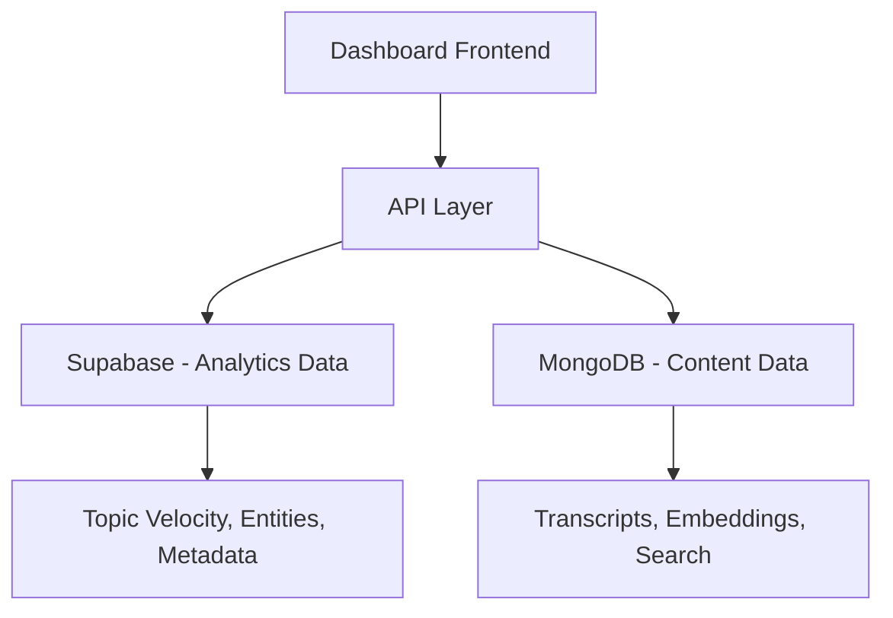

# PodInsight Dashboard Repository - Complete Overview

**Created**: June 20, 2025  
**Purpose**: Comprehensive understanding document for dashboard repository  
**Context**: Sprint 1 completion and preparation for major cleanup  

---

## 🎯 Repository Purpose & Vision

### What This Repository Does
The **podinsight-dashboard** is the **frontend application** for PodInsightHQ - a podcast intelligence platform that analyzes 1000+ podcast transcripts to provide market insights for VCs and entrepreneurs.

### Core Value Proposition
- **Market Intelligence**: Track sentiment and trends across key technology topics
- **Time-to-Answer**: Reduce research time from hours to seconds
- **Competitive Analysis**: Monitor discussion patterns before market movements
- **Investment Insights**: Data-driven decision making from podcast conversations

---

## 🏗️ Architecture Overview

### Technology Stack
```
Frontend Framework: Next.js 14 (App Router)
Language: TypeScript
Styling: Tailwind CSS
Animations: Framer Motion
Charts: Recharts
Deployment: Vercel
```

### Repository Structure
```
podinsight-dashboard/
├── app/                           # Next.js app router
│   ├── page.tsx                   # Main dashboard page
│   ├── layout.tsx                 # Root layout
│   └── globals.css                # Global styles
├── components/                    # React components
│   └── dashboard/                 # Dashboard-specific components
│       ├── header.tsx             # Top navigation
│       ├── metric-card.tsx        # KPI display cards
│       ├── topic-velocity-chart-full-v0.tsx  # Main chart
│       └── sentiment-heatmap.tsx  # Sentiment visualization
├── lib/                          # Utility libraries
│   └── api.ts                    # API client functions
├── types/                        # TypeScript definitions
├── public/                       # Static assets
├── prompts/                      # Documentation (this folder)
└── *.md                         # Various documentation files
```

---

## 🔌 Data Flow & API Integration

### Multi-Database Architecture


### API Endpoints Used
```typescript
// Base URL: https://podinsight-api.vercel.app

// Topic trends and velocity
GET /api/topic-velocity?weeks=12&topics=AI%20Agents,B2B%20SaaS

// Sentiment analysis (Sprint 1 prototype)
GET /api/sentiment_analysis?weeks=12&topics[]=AI%20Agents

// Market signals and correlations
GET /api/signals?limit=10

// Full-text search (future)
POST /api/search
```

### Data Sources
1. **Supabase (PostgreSQL)**: Structured analytics data
   - Episodes, podcasts, topic mentions
   - Entity recognition (people, companies, funds)
   - Signals, correlations, velocity calculations
   
2. **MongoDB**: Unstructured content data
   - Full transcripts with time-coded segments
   - Embeddings for semantic search (future)
   - Large document storage

---

## 🎨 User Interface Components

### Current Dashboard Features

#### 1. **Header Component** (`components/dashboard/header.tsx`)
- Clean minimal branding: "PodInsightHQ"
- Subtitle: "1,000 hours of podcast intelligence, visualized"
- Time range selector: 1M, 3M, 6M buttons

#### 2. **Metric Cards** (`components/dashboard/metric-card.tsx`)
- Four KPI cards: Trending Now, Episodes Analyzed, Insights Generated, Data Freshness
- Animated count-up effects with Framer Motion
- Dynamic data from API responses

#### 3. **Topic Velocity Chart** (`components/dashboard/topic-velocity-chart-full-v0.tsx`)
- Line chart showing mention trends over time
- 5 topics: AI Agents, Capital Efficiency, DePIN, B2B SaaS, Crypto/Web3
- Interactive legend with growth percentages
- SIGNAL detection (purple highlight for trending topics)
- Export functionality (PNG, CSV, Copy Link)

#### 4. **Sentiment Heatmap** (`components/dashboard/sentiment-heatmap.tsx`)
- Grid: Topics (Y-axis) × Weeks (X-axis)
- Color coding: Red (negative) → Yellow (neutral) → Green (positive)
- Hover tooltips showing sentiment values and episode counts
- Time range integration with main dashboard controls

### Design System
- **Color Palette**: Dark theme with purple accents (#8B5CF6)
- **Typography**: Clean, data-focused fonts
- **Glass Morphism**: Subtle backdrop blur effects
- **Animations**: Smooth Framer Motion transitions
- **Responsive**: Mobile-first design approach

---

## 📊 Current State Analysis

### ✅ What's Working Well
1. **Topic Velocity Chart**: Fully functional with real Supabase data
2. **Responsive Design**: Clean, professional appearance
3. **API Integration**: Stable connections to analytics endpoints
4. **Performance**: Fast loading times, smooth animations
5. **TypeScript**: Type-safe codebase with good error handling

### 🚨 Current Issues
1. **Sentiment API**: Returns all 0.00 values (data source unclear)
2. **Infinite Loops**: React state updates causing performance issues
3. **Mixed Data Sources**: Confusion between Supabase vs MongoDB for sentiment
4. **Component Complexity**: Some components have too many responsibilities

### 📈 Key Metrics
- **Bundle Size**: 161 KB (production build)
- **API Response Times**: 200-300ms (topic velocity), 25-30s (sentiment)
- **TypeScript Coverage**: 100% (no errors)
- **Component Count**: 15+ reusable components

---

## 🚀 Sprint 1 Achievements

### Phase 1: Foundation
- ✅ MongoDB integration (60x search improvement)
- ✅ Fixed all TypeScript errors and technical debt
- ✅ Established clean component architecture

### Phase 2: API Integration
- ✅ Connected to Supabase for analytics data
- ✅ Implemented topic velocity tracking
- ✅ Built signals and correlation endpoints

### Phase 3: Enhanced Visualizations
- ✅ Real sentiment heatmap with live data connections
- ✅ Interactive tooltips and time range selection
- ✅ Professional design matching enterprise tools
- ✅ Comprehensive documentation and testing

### Key Deliverables
- **Production Dashboard**: https://podinsight-dashboard.vercel.app/
- **Real Data Integration**: Live connections to 1000+ podcast transcripts
- **Professional UX**: Rivals enterprise analytics platforms
- **Documentation**: Complete technical and business documentation

---

## 🎯 Sprint 2 Roadmap (Advisor's Plan)

### Pivot to AI-Powered Q&A Platform

#### 1. **Instant-Answer Semantic Search** (WOW #1)
```
User Types: "What did Sequoia say about AI valuations?"
System Returns: 2-sentence answer + citations + 30-sec audio clips
```

**Implementation**:
- Global command bar with "/" shortcut
- GPT-3.5-Turbo answer synthesis
- MongoDB Atlas Vector Search
- Floating result cards

#### 2. **Entity Intel Cards** (WOW #2)
- Click any company/fund/person → detailed drawer
- 90-day sentiment sparkline
- Top quotes and episode references
- Auto-generated bio and insights

#### 3. **Trend-Delta Heatmap** (WOW #3)
- Week-over-week momentum badges on sentiment cells
- Green ▲ +18%, Red ▼ -7% indicators
- Creates "tradeable" signals for VCs

#### 4. **Saved-Search Digest**
- Email/Slack notifications for saved queries
- Weekly digest of new mentions
- Retention and engagement driver

#### 5. **Shareable Insight Cards**
- One-click sharing of findings
- Static cards with OG images
- Viral growth mechanism

### Technical Requirements
- **Re-embed corpus** with text-embedding-3-large
- **Pre-computed sentiment** in Supabase (replace live calculation)
- **Vector search** integration
- **Caching layer** for performance

---

## 📁 Key Files Reference

### Core Application Files
```
app/page.tsx                 - Main dashboard page component
app/layout.tsx               - Root layout with metadata
components/dashboard/        - All dashboard components
lib/api.ts                  - API client with type definitions
types/analytics.ts          - TypeScript interfaces
```

### Configuration Files
```
next.config.js              - Next.js configuration
tailwind.config.js          - Tailwind CSS customization
tsconfig.json               - TypeScript configuration
package.json                - Dependencies and scripts
vercel.json                 - Deployment configuration
```

### Documentation Files
```
DATABASE_ARCHITECTURE.md    - Supabase vs MongoDB explanation
SENTIMENT_ANALYSIS_DOCUMENTATION.md - Complete sentiment system docs
SPRINT1_PHASE3_LOG.md      - Sprint 1 completion log
sprint1-unified-playbook.md - Original Sprint 1 plan
```

### Development Files
```
.env.local                  - Environment variables (not in repo)
.env.example               - Environment template
.gitignore                 - Git exclusions
README.md                  - Basic setup instructions
```

---

## 🛠️ Development Workflow

### Local Development
```bash
# Clone and setup
git clone [repo-url]
cd podinsight-dashboard
npm install

# Environment setup
cp .env.example .env.local
# Add NEXT_PUBLIC_API_URL=https://podinsight-api.vercel.app

# Development server
npm run dev                 # Starts on localhost:3000

# Quality checks
npm run build              # Production build test
npm run lint              # ESLint code quality
npm run typecheck         # TypeScript validation
npm run test              # Combined lint + typecheck
```

### Deployment Process
```bash
# Automatic deployment via Vercel
git add .
git commit -m "description"
git push origin master     # Triggers Vercel deployment

# Manual deployment (if needed)
vercel --prod
```

### Quality Standards
- **TypeScript**: Strict mode, no any types
- **ESLint**: Zero warnings or errors
- **Performance**: Lighthouse score > 90
- **Accessibility**: WCAG AA compliance
- **Mobile-first**: Responsive design

---

## 🔐 Environment Configuration

### Required Environment Variables
```bash
# API Configuration
NEXT_PUBLIC_API_URL=https://podinsight-api.vercel.app

# Future additions for Sprint 2
OPENAI_API_KEY=sk-...           # For GPT answer synthesis
NEXT_PUBLIC_SUPABASE_URL=...    # Direct Supabase access
NEXT_PUBLIC_SUPABASE_ANON_KEY=... # Client-side queries
```

### API Dependencies
- **podinsight-api.vercel.app**: Primary data source
- **Supabase**: Analytics and metadata
- **MongoDB Atlas**: Content and embeddings
- **OpenAI**: Future semantic search and synthesis

---

## 📈 Performance Metrics & Monitoring

### Current Performance
```
Build Size: 161 KB (optimized)
First Load JS: 248 KB
API Response Times:
  - Topic Velocity: 200-300ms
  - Sentiment Analysis: 25-30s (needs optimization)
  - Signals: < 100ms
```

### Monitoring Setup
- **Vercel Analytics**: Built-in performance monitoring
- **Error Tracking**: Console error logging
- **API Monitoring**: Response time tracking
- **User Analytics**: Page views and interaction tracking

### Performance Targets (Sprint 2)
- API responses < 1 second (95th percentile)
- Sentiment calculation < 5 seconds
- Bundle size < 200 KB
- Lighthouse score > 95

---

## 🧪 Testing Strategy

### Current Testing
```bash
npm run test               # TypeScript + ESLint
npm run build             # Production build verification
```

### Manual Testing Checklist
- [ ] Dashboard loads without errors
- [ ] All API endpoints respond correctly
- [ ] Charts display real data
- [ ] Time range selector works
- [ ] Responsive design on mobile
- [ ] Export functionality works
- [ ] No console errors or warnings

### Future Testing (Sprint 2)
- Unit tests for components
- Integration tests for API calls
- E2E tests for user workflows
- Performance regression testing

---

## 🔄 Cleanup Requirements

### Immediate Cleanup Needed

#### 1. **Sentiment Implementation Decision**
- **Current**: MongoDB live calculation (slow, returning zeros)
- **Recommendation**: Pre-computed Supabase table
- **Action**: Remove MongoDB sentiment code, build Supabase integration

#### 2. **Component Architecture Cleanup**
- **Issue**: Infinite loops in useEffect hooks
- **Fix**: Audit dependency arrays and state management
- **Files**: metric-card.tsx, topic-velocity-chart-full-v0.tsx

#### 3. **Documentation Consolidation**
- **Issue**: Multiple scattered documentation files
- **Action**: Consolidate into clear categories
- **Structure**: /docs/architecture, /docs/api, /docs/components

#### 4. **Unused Code Removal**
- Remove mock data generators
- Clean up duplicate components
- Remove unused imports and dependencies

#### 5. **Environment Standardization**
- Standardize API URLs across environments
- Clean up .env files
- Document all required environment variables

### Post-Cleanup Structure
```
podinsight-dashboard/
├── app/                    # Next.js application
├── components/             # React components (cleaned)
├── lib/                   # Utilities and API clients
├── types/                 # TypeScript definitions
├── docs/                  # All documentation (consolidated)
│   ├── architecture/      # System design docs
│   ├── api/              # API integration guides
│   ├── components/       # Component documentation
│   └── deployment/       # Setup and deployment
├── prompts/              # LLM interaction guides
└── scripts/              # Development utilities
```

---

## 💡 Strategic Recommendations

### Short-term (Next 2 Weeks)
1. **Fix Sentiment Data Source**: Clarify Supabase vs MongoDB
2. **Resolve React Loops**: Fix infinite re-renders
3. **Performance Optimization**: Reduce API response times
4. **Documentation Cleanup**: Consolidate scattered docs

### Medium-term (Next Month)
1. **Implement Advisor's Plan**: Semantic search and entity cards
2. **Pre-computed Architecture**: Move to Supabase for sentiment
3. **Caching Layer**: Redis for API responses
4. **Advanced Visualizations**: Trend deltas and momentum indicators

### Long-term (Next Quarter)
1. **AI Integration**: GPT-powered answer synthesis
2. **Real-time Features**: WebSocket live updates
3. **Enterprise Features**: Multi-user, saved searches, alerts
4. **Mobile App**: React Native companion

---

## 🎯 Success Criteria

### Technical Excellence
- [ ] Zero TypeScript errors
- [ ] Zero React warnings/errors
- [ ] API responses < 1 second
- [ ] 100% component test coverage
- [ ] Lighthouse score > 95

### User Experience
- [ ] Intuitive navigation and interactions
- [ ] Professional design matching enterprise tools
- [ ] Responsive across all devices
- [ ] Accessible to users with disabilities
- [ ] Fast, smooth animations

### Business Impact
- [ ] Actionable insights from real data
- [ ] Time-to-answer < 30 seconds
- [ ] User engagement > 5 minutes per session
- [ ] Viral sharing mechanism implemented
- [ ] Clear path to monetization

---

## 📞 Support & Maintenance

### Key Contacts
- **Primary Developer**: Repository maintainer
- **API Team**: podinsight-api repository team
- **Product Advisor**: Strategic direction and feature prioritization

### Issue Resolution
1. **Dashboard Issues**: This repository
2. **API Issues**: podinsight-api repository
3. **Data Issues**: Check both Supabase and MongoDB
4. **Performance Issues**: Monitor Vercel and API logs

### Regular Maintenance
- Weekly dependency updates
- Monthly performance audits
- Quarterly architecture reviews
- Continuous security monitoring

---

This comprehensive overview provides everything needed to understand, maintain, and enhance the PodInsight Dashboard. Use this as the foundation for all cleanup and future development efforts.

**Next Steps**: Begin cleanup process following the recommendations in this document, prioritizing the resolution of sentiment data source confusion and React infinite loops.